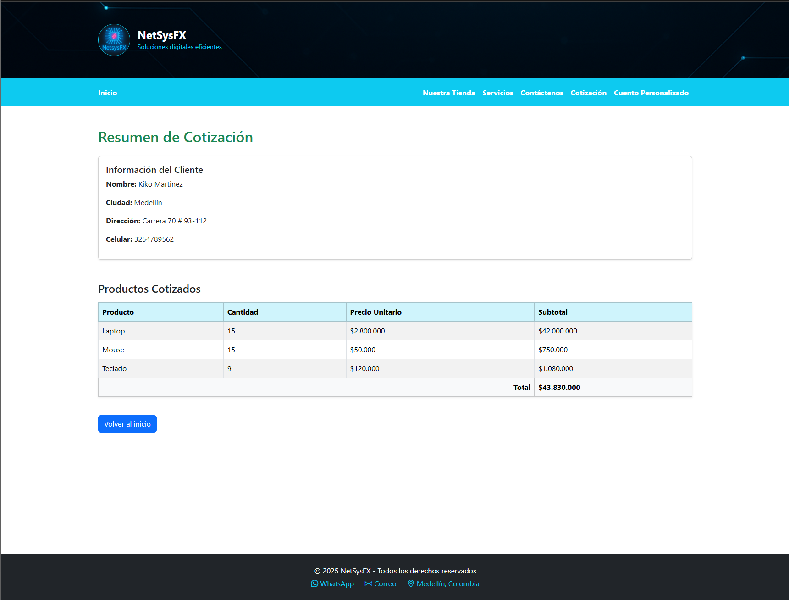

# NetSysFX – Tienda Web JSP

Sitio web académico desarrollado en Java utilizando JSP, Servlets y Bootstrap 5, con arquitectura MVC. Simula una tienda online de tecnología con flujo completo de cotización.

---

## Tecnologías usadas

- Java 17
- JSP + Servlets
- HTML5 + CSS3 + Bootstrap 5.3.6
- MySQL + JDBC
- GlassFish Server
- NetBeans 20

---

## Arquitectura

- Patrón MVC (Modelo Vista Controlador)
- DAO (Acceso a Datos separado para escalabilidad)
- JSPs modulares (Cabecero, Navegación, Footer)
- Bootstrap 100% integrado para diseño responsivo

---

## Funcionalidades

- Página principal con header, banner y branding de NetSysFX
- Sección **Nuestra Tienda** con presentación del CEO
- Sección **Cuento Personalizado** generado a partir de un formulario dinámico
- **Nueva sección:** **Solicitud de Cotización**
  - Formulario con campos obligatorios: Nombre, Ciudad, Dirección, Celular
  - Selección de productos por checkbox + cantidad
  - Al enviar:
    - Se almacena en MySQL en dos tablas (`solicitudes` y `productos_solicitados`)
    - Se muestra resumen en tabla con nombre del producto, cantidad, precio unitario y total cotizado
  - Lógica desacoplada mediante DAO

---

## Base de Datos

### Tablas usadas:

- `solicitudes`: Datos personales de quien cotiza
- `productos_solicitados`: Productos y cantidades (relacionado con ID de solicitud)

---

## Captura de resumen

---

## Autor

**Andrés Felipe Paniagua Villada**  
Fundador y CEO de [NetSysFX](https://netsysfx.com)  
Proyecto académico – Universidad Católica del Norte  
Materia: Lenguajes de Programación Web

---

